# 大数据系统实验报告

## 一、小组成员以及分工

冯筱璐（PB21151753）：主要负责Hadoop、Hbase环境配置，Hbase数据库搭建，以及Flask前端美化。

陆叶青（PB21081591）：主要负责编写爬虫程序，用于实现从科大候选网站中爬取相关文件，并以文件名和文件网址链接的形式组织文件的存储方式。

岳雨昕（）：

## 二、技术路线

### 1. 爬虫

从39个科大网站中爬取共659条数据。
### 2. Hadoop及Hbase环境搭建
#### Hadoop环境搭建
(1)**core-site.xml**
*默认文件系统url、临时文件存储目录*
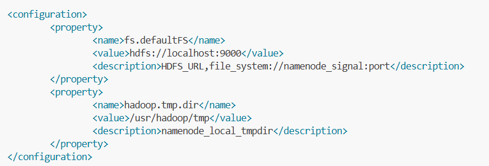
(2)**yarn-site.xml**
*nodemaneger辅助服务、resourcemanager的web应用、环境变量白名单*
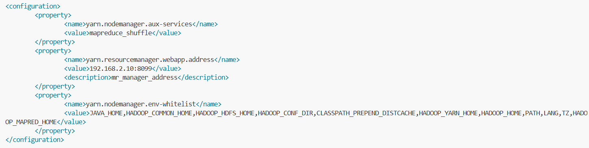
(3)**mapred-site.xml**
*mapper、reduce执行框架、应用程序类路径classpath*
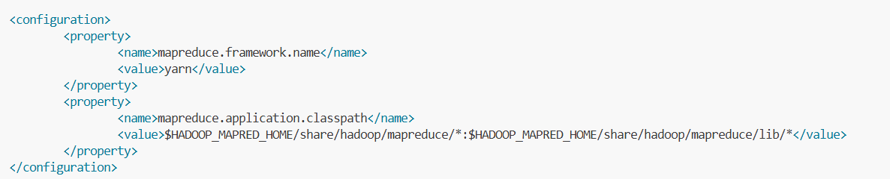
(4)**Hadoop-env.sh**
*JAVA_HOME配置*

(5)**yarn-env.sh**
*JAVA_HOME配置*

#### Hbase环境搭建
(1)**hbase-site.xml**
*hbase存储根目录z、ookeeper存储根目录、启动安全性检查、启动分布式模式*
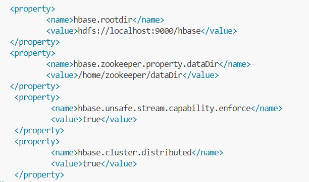
(2)**hdfs-site.xml**
*namenode存储目录、datanode存储目录、文件副本数量*
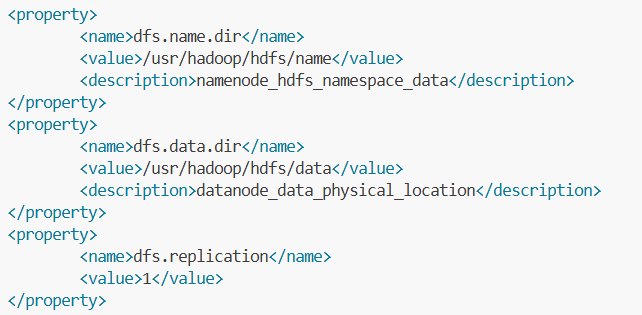
(3)**hbase-env.sh**
*JAVA_HOME配置、启用内置ZK*
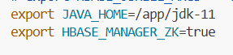

#### 系统环境变量配置
**/etc/profile**
*JAVA_HOME、HADOOP_HOME、HBASE_HOME、HBASE_CONF_DIR
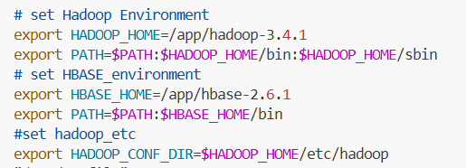

## 三、功能介绍以及效果展示

### 1. 爬虫

笔者选取了总共39个科大网站，列举如下。其中{page_num}代表在实际爬取过程中要替换为index的部分。

| url网址                                                   | 网站名称                                       |
| --------------------------------------------------------- | ---------------------------------------------- |
| https://saids.ustc.edu.cn/15435/list{page_num}.htm        | 大数据学院                                     |
| https://finance.ustc.edu.cn/xzzx/list{page_num}.psp       | 财务处                                         |
| https://stuhome.ustc.edu.cn/2310/list{page_num}.htm       | 学工在线                                       |
| https://bwc.ustc.edu.cn/5655/list{page_num}.htm           | 保卫与校园管理处                               |
| http://zhb.ustc.edu.cn/18534/list{page_num}.htm           | 科技成果转移转化办公室                         |
| http://young.ustc.edu.cn/15056/list{page_num}.htm         | 青春科大                                       |
| http://cs.ustc.edu.cn/20158/list{page_num}.psp            | 计算机科学技术学院                             |
| http://cybersec.ustc.edu.cn/zlxz_23830/list{page_num}.psp | 网络空间安全学院                               |
| https://math.ustc.edu.cn/wswd/list{page_num}.htm          | 数学科学学院 类别：外事文件                    |
| https://math.ustc.edu.cn/tszy/list{page_num}.htm          | 数学科学学院 类别：图书资源                    |
| https://math.ustc.edu.cn/gkkzy/list{page_num}.htm         | 数学科学学院 类别：公开课资源                  |
| http://press.ustc.edu.cn/tgxz/list{page_num}.htm          | 出版社    类别：投稿须知                       |
| http://press.ustc.edu.cn/xtxxb/list{page_num}.htm         | 出版社    类别：选题信息表                     |
| http://press.ustc.edu.cn/bzgf/list{page_num}.htm          | 出版社    类别：标准规范                       |
| http://press.ustc.edu.cn/wjfg/list{page_num}.htm          | 出版社    类别：文件法规                       |
| http://press.ustc.edu.cn/jxzy/list{page_num}.htm          | 出版社    类别：教学资源                       |
| https://ispc.ustc.edu.cn/6299/list{page_num}.psp          | 信息科学试验中心   类别：申请与登记            |
| https://ispc.ustc.edu.cn/6298/list{page_num}.htm          | 信息科学试验中心   类别：技术文档              |
| http://ustcnet.ustc.edu.cn/33489/list{page_num}.psp       | 网络信息中心    类别：规章制度                 |
| http://ustcnet.ustc.edu.cn/33490/list{page_num}.psp       | 网络信息中心    类别：网字文件                 |
| http://ustcnet.ustc.edu.cn/33491/list{page_num}.psp       | 网络信息中心    类别：校网字文件               |
| http://ustcnet.ustc.edu.cn/33492/list{page_num}.psp       | 网络信息中心    类别：相关文件                 |
| https://zhc.ustc.edu.cn/zcgll/list{page_num}.htm          | 资产与后勤保障处    类别：资产管理类           |
| https://zhc.ustc.edu.cn/fcgll/list{page_num}.htm          | 资产与后勤保障处    类别：房产管理类           |
| https://zhc.ustc.edu.cn/cggll/list{page_num}.htm          | 资产与后勤保障处    类别：采购管理类           |
| https://zhc.ustc.edu.cn/hqbzyzhgll/list{page_num}.htm     | 资产与后勤保障处    类别：后勤保障与综合管理类 |
| https://sist.ustc.edu.cn/5111/list{page_num}.htm          | 信息科学技术学院    类别：本科生教育           |
| https://sist.ustc.edu.cn/5104/list{page_num}.htm          | 信息科学技术学院    类别：研究生教育           |
| https://sist.ustc.edu.cn/5128/list{page_num}.htm          | 信息科学技术学院    类别：党建工作             |
| https://sist.ustc.edu.cn/5095/list{page_num}.htm          | 信息科学技术学院    类别：学习工作             |
| https://sist.ustc.edu.cn/5085/list{page_num}.htm          | 信息科学技术学院    类别：科学研究             |
| https://sist.ustc.edu.cn/5079/list{page_num}.htm          | 信息科学技术学院    类别：信息服务             |
| https://sse.ustc.edu.cn/19878/list{page_num}.htm          | 软件学院      类别：教学管理                   |
| https://sse.ustc.edu.cn/19879/list{page_num}.htm          | 软件学院      类别：招生管理                   |
| https://sse.ustc.edu.cn/19880/list{page_num}.htm          | 软件学院      类别：就业管理                   |
| https://sse.ustc.edu.cn/19882/list{page_num}.htm          | 软件学院      类别：工程实践                   |
| https://sse.ustc.edu.cn/19884/list{page_num}.htm          | 软件学院      类别：党团建设                   |
| https://sse.ustc.edu.cn/19885/list{page_num}.htm          | 软件学院      类别：学生管理                   |

在实现爬虫的过程中，定义一个Crawler爬虫类来实现爬虫的功能。

首先对于一个网站的url，使用fetch_html()函数获取它的html文本。

然后对一个web页面的html使用beautifulsoup进行解析，使用find_all（）方法得到此页面中所有文件标签列表并存储在soup_results里面。对于soup_results里面的每个文件再去find相应的title标签和url标签，值得注意的是直接从html解析出来的url标签需要在前面加上base_url才能形成完整的标签。

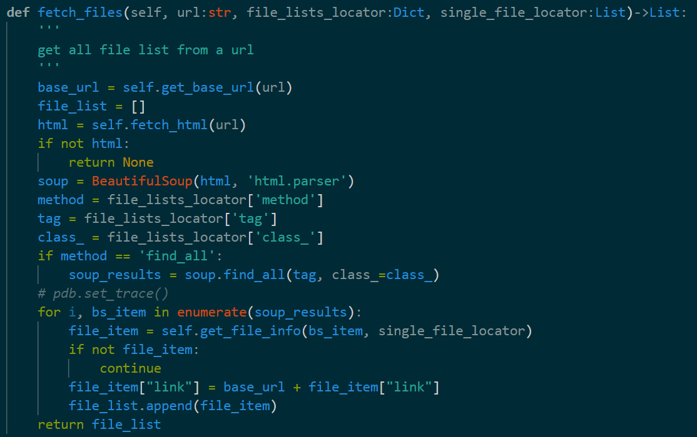

对于soup_results中的每条内容，使用get_file_info()来得到相应的title和url。

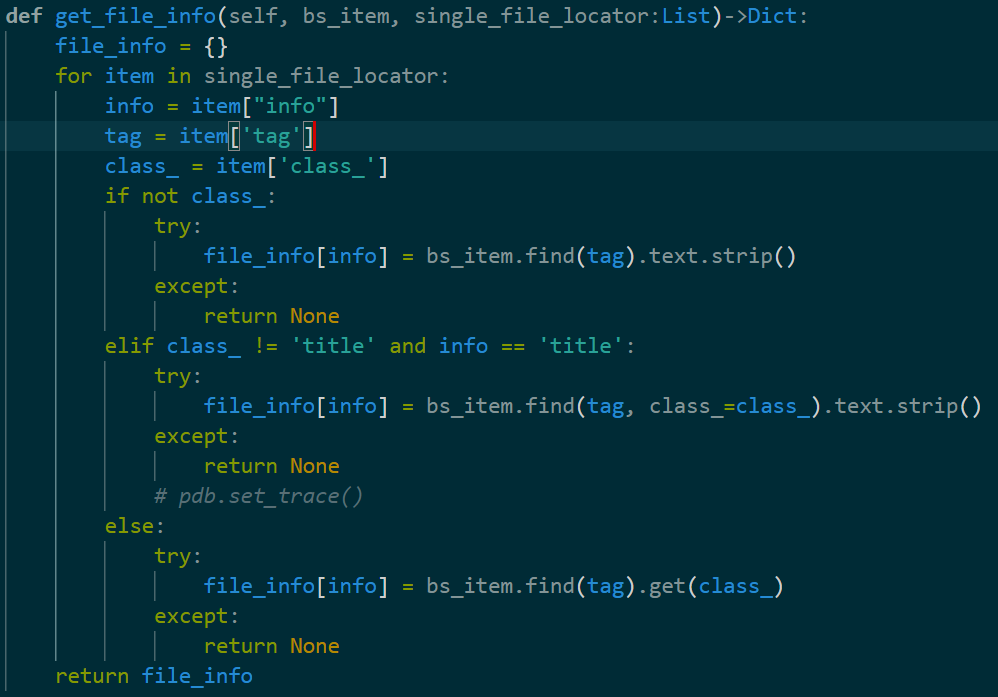

对于输入的文件格式，笔者使用json文件，存储需要爬取网站的内容。对于上述列表中提到的每个网站，通过查看网站相应的页面源代码，来获取其中文件内容的标签以及相应的爬取方式，并以字典的格式清晰地存储组织，示例如下：

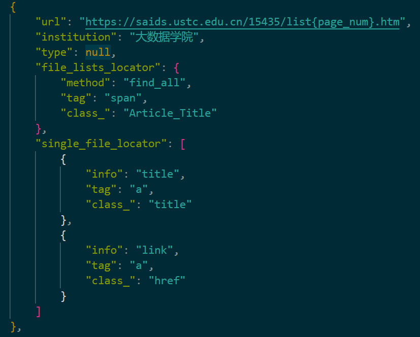

我们的系统从39个科大网站中爬取了659条文件数据，如下图所示。爬取的内容为文件名称和文件的url网址。

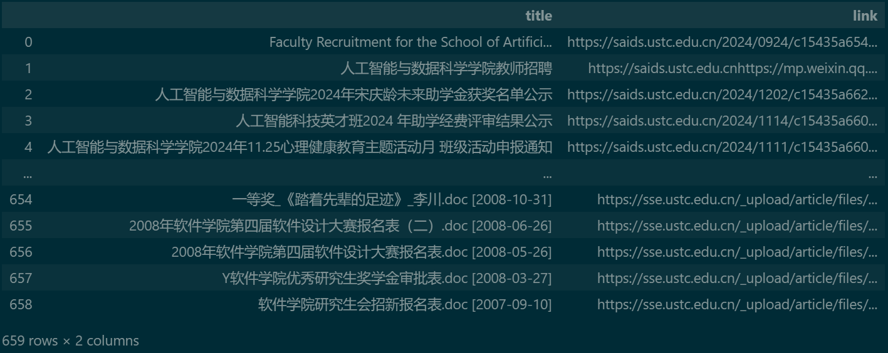

### 2. Hbase数据库搭建
**(1)所需进程启动：**
**Hadoop**:Namenode、Datanode
**Hbase**:HMaster、HregionServer
**Zookeeper**:HQuorumPeer
**Thrift**:ThriftServer
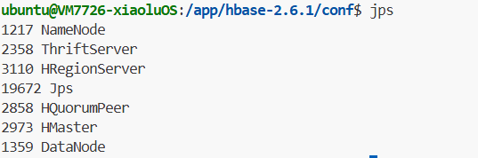

**(2)爬虫数据上传：**
以文件名'title'为'row_key'，在Hbase中建表上传爬取的文件数据
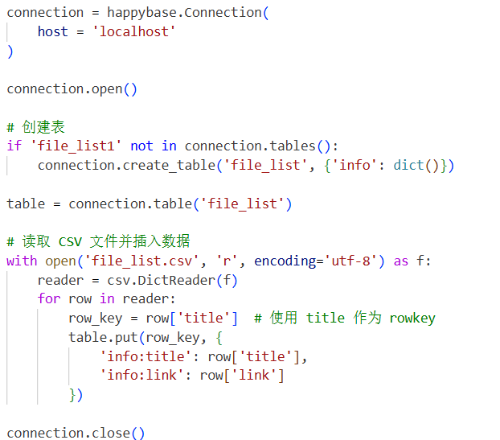
上传成功效果展示：
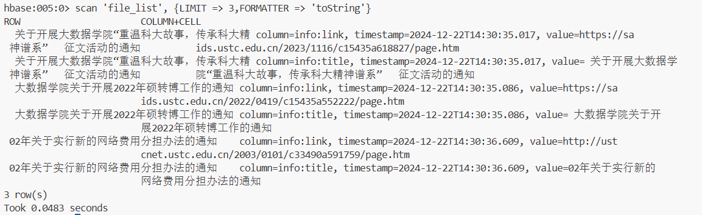

## 四、遇到的问题及解决
### 1. hadoop与hbase的jar包不匹配：
阻止Hbase动态地将 Hadoop 的 Classpath 加载到 HBase 的运行时环境中，而是依赖手动设置的 Classpath。

### 2. HBase 无法访问 HDFS 文件系统中的数据存储目录：
fs.defaultFS与hbase.rootdir需要配置一致。

## 五、实践心得

冯筱璐：在配置环境的过程中，进一步熟悉了linux的命令行操作，理解了Hadoop、Hbase的配置文件中各个参数的含义，从更为底层的视角理解了Hadoop、Hbase与Zookeeper的协同工作逻辑，更好地掌握了大数据系统的相关知识。

陆叶青：在本次实验中，我学习了如何使用爬虫来爬取网页内容，通过beautifulsoup这一库函数来实现html标签的查找。在设计输入时，使用json文件定义输入网站的url和标签内容，使得针对不同网页，可以有统一的爬取方式，方便复用与迁移。

岳雨昕：